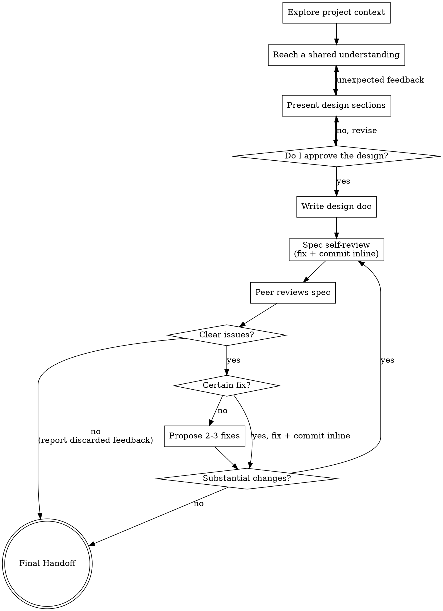

# Brainstorming Ideas Into Designs

Help turn ideas into fully formed designs and specs through natural collaborative dialogue.

Start by understanding the current project context, then ask questions one at a time to refine the idea. Once you understand what you're building, present the design and get my approval.

<HARD-GATE>
Do NOT invoke any implementation skill, write any code, scaffold any project, or take any implementation action until you have presented a design and I have approved it. This applies to EVERY project regardless of perceived simplicity.
</HARD-GATE>

Include the /domain-modeling skill throughout this session. Changes to the ADRs and CONTEXT.md are complementary to the final spec. The final spec provides the detail necessary to plan and implement what is brainstormed. The ADRs will provide context afterwards to explain what was done and why. The CONTEXT.md keeps those conversations coherent.

## Anti-Pattern: "This Is Too Simple To Need A Design"

Every project goes through this process. A todo list, a single-function utility, a config change — all of them. "Simple" projects are where unexamined assumptions cause the most wasted work. The design can be short (a few sentences for truly simple projects), but you MUST present it and get approval.

## Checklist

You MUST create a task for each of these items and complete them in order:

1. **Explore project context** — check files, docs, recent commits
2. **Reach a shared understanding** — one at a time, understand purpose/constraints/success criteria
3. **Present design** — in sections scaled to their complexity, get my approval after each section
4. **Write design doc** — save to `docs/honist-v/specs/YYYY-MM-DD-<topic>-design.md` and commit
5. **Spec self-review** — quick inline check for placeholders, contradictions, ambiguity, scope (see below)
6. **Peer review** — use prompt-a-peer-high to review the committed spec, fix clear issues
7. **Ready for handoff** — all open concerns addressed

## Process Flow

## The Process

**Explore project context:**

- Check out the current project state first (files, docs, recent commits)
- Before asking detailed questions, assess scope: if the request describes multiple independent subsystems (e.g., "build a platform with chat, file storage, billing, and analytics"), flag this immediately. Don't spend questions refining details of a project that needs to be decomposed first.
- If the project is too large for a single spec, help me decompose it into sub-projects: what are the independent pieces, how do they relate, what order should they be built? Then brainstorm the first sub-project through the normal design flow. Each sub-project gets its own spec → plan → implementation cycle.

**Reach a shared understanding:**

Interview me relentlessly about every aspect of this design until we reach a shared understanding. Walk down each branch of the decision tree, resolving dependencies between decisions one-by-one. For each question, provide your recommended answer. The understanding should encompass purpose, constraints and success criteria.

Ask the questions one at a time, waiting for feedback on each question before continuing. Asking multiple questions at once is bewildering.

Prefer multiple choice questions and discuss the tradeoffs of each choice. If there are no tradeoffs to compare then consider an open ended question or pick at assumptions.

If a _fact_ can be found by exploring the environment (filesystem, tools, etc.), look it up rather than asking me. The _decisions_, though, are mine — put each one to me and wait for my answer.

YAGNI ruthlessly - Understand the purpose of every feature.

Continue with this interview phase until I confirm we have reached a shared understanding. Any new ADR should be established by now.

**Presenting the design:**

- Once you believe you understand what you're building, present the design
- Scale each section to its complexity: a few sentences if straightforward, up to 200-300 words if nuanced
- Ask after each section whether it looks right so far
- Cover: architecture, components, data flow, error handling, testing
- If there is unexpected feedback return to **Reach a shared understanding**.

**Design for isolation and clarity:**

- Break the system into smaller units that each have one clear purpose, communicate through well-defined interfaces, and can be understood and tested independently
- For each unit, you should be able to answer: what does it do, how do you use it, and what does it depend on?
- Can someone understand what a unit does without reading its internals? Can you change the internals without breaking consumers? If not, the boundaries need work.
- Smaller, well-bounded units are also easier for you to work with - you reason better about code you can hold in context at once, and your edits are more reliable when files are focused. When a file grows large, that's often a signal that it's doing too much.

**Working in existing codebases:**

- Explore the current structure before proposing changes. Follow existing patterns.
- Where existing code has problems that affect the work (e.g., a file that's grown too large, unclear boundaries, tangled responsibilities), include targeted improvements as part of the design - the way a good developer improves code they're working in.
- Don't propose unrelated refactoring. Stay focused on what serves the current goal.

## After the Design

**Documentation:**

- Write the validated design (spec) to `docs/honist-v/specs/YYYY-MM-DD-<topic>-design.md`
- Commit the design document to git

**Spec Self-Review:** After writing the spec document, look at it with fresh eyes:

1. **Placeholder scan:** Any "TBD", "TODO", incomplete sections, or vague requirements? Fix them.
2. **Internal consistency:** Do any sections contradict each other? Does the architecture match the feature descriptions?
3. **Scope check:** Is this focused enough for a single implementation plan, or does it need decomposition?
4. **Ambiguity check:** Could any requirement be interpreted two different ways? If so, pick one and make it explicit.

Fix any issues inline. No need to re-review — just commit the fixes and move on.

**Peer Review:** After the spec self-review passes and changes have been committed, use the **prompt-a-peer-high** skill to have a peer review the committed spec. If a peer reviewed an earlier version of the spec, ask it to review the changes since.

- For feedback that points to a clear issue with a certain fix go ahead and commit the fix inline.
- Tell me about feedback that did not indicate a clear issue and is being discarded.
- Go to **Propose 2-3 fixes** to explore fixes for clear issues without a certain fix, otherwise skip to **Final Handoff**.

**Propose 2-3 fixes** For each clear issue without a certain fix:

- Propose 2-3 different fixes with their trade-offs.
- Present options conversationally with your recommendation and reasoning.
- Lead with your recommended option and explain why.
- Always indicate the tradeoffs of each approach. If there is no differentiation in the tradeoffs then also explain why the solution to the fix is uncertain.

Fix and commit issues inline. If there were substantial changes made return to **Spec Self-Review** otherwise continue to **Final Handoff**.

**Final Handoff:** After the spec review loop passes, ask me to review the written spec before proceeding:

> "Spec committed. Please review it and let me know if you want to make any changes. Once you think the spec is ready continue with /writing-plans `<path>`"

Stop here. It's my turn to act, do not implement anything or invoke any other skill.
